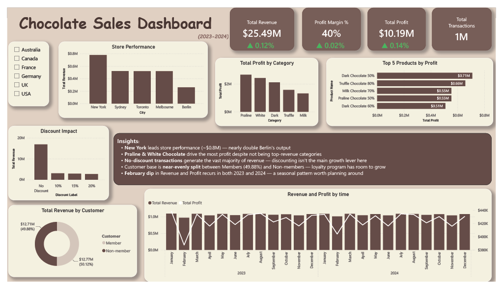

# Chocolate Sales Dashboard

Single-page chocolate sales analytics dashboard built with Power BI — analyzing 1M+ transactions across 6 countries with star schema data modeling and YoY trend analysis.

## Overview
This project models a star schema data warehouse (5 related tables: Sales, Products, Stores, Customers, Calendar) to analyze chocolate sales performance across global markets from 2023–2024. The dashboard combines profitability, discount strategy, and customer loyalty analysis into a single executive view.

## Business Questions
- Which stores and product categories drive the most profit?
- Does discounting meaningfully impact revenue?
- How loyal is the customer base (Member vs Non-member)?
- Are there seasonal patterns in revenue and profit?
- How did key metrics perform year-over-year (2023 vs 2024)?

## Tools & Skills
- **Power BI**: Star schema data modeling across 5 related tables
- **DAX**: CALCULATE, DIVIDE, custom YoY growth measures
- **Power Query**: Data transformation and relationship management
- **Data Storytelling**: Insight writing with business implications

## Dashboard Preview

## Key Insights
- New York leads store performance (~$0.8M revenue) — approximately 3x Berlin's output
- Praline & White Chocolate drive the most profit despite not being top-revenue categories
- No-discount transactions generate the vast majority of revenue — discounting isn't the main growth lever
- Customer base is near-evenly split between Members (49.88%) and Non-members — loyalty program has room to grow
- A recurring February dip in Revenue and Profit appears in both 2023 and 2024, suggesting a seasonal pattern worth planning around
- Revenue, Profit, and Profit Margin all grew modestly YoY (2023 → 2024)

## Files
- `Chocolate Sales Dashboard.pbix` — Power BI dashboard file
- `Chocolate Sales Dashboard.pdf` — Full dashboard export
